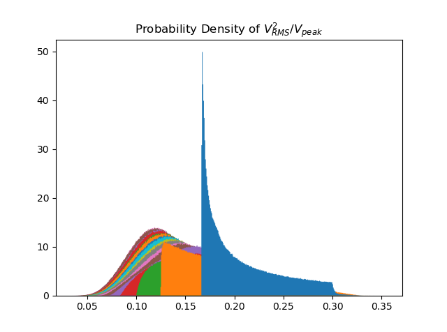
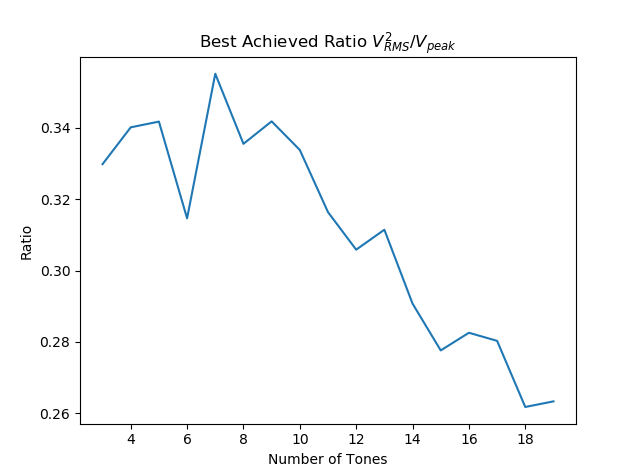

Other
#####

Proposed Upgrades
=================
Write a standard procedure to save any waveform to maintained collection of HDF5 database files, organizing by
parameters. Include an option for bypassing the automatic saving of each waveform.

.. todolist::

Art
===

When forming a superposition of pure tones, we had a choice for each tones magnitude & relative phase. The former were
chosen to optimize for homogeneous trap intensities, but the latter were chosen to correct a more subtle issue. When a
multitude of tones are superimposed upon each other, inevitably many of those tones will constructively align, forming
a massive amplitude peak. This may not necessarily happen for various sets of relative phases.

For a given superposition, we consider the ratio: **Mean Squared Amplitude** over **Peak Value**. We optimize the
relative phases to maximize this quantity. In the process of developing the method, we discovered a few intriguing
structures & validated some hunches.

Hidden Beauty
-------------

Here we have some rather gorgeous maps. Each map is associated with some superposition of pure tones. The axes
represent relative phases of 2 particular pure tones in the superposition, while the pixel intensity represents
the aforementioned ratio.

.. image:: _static/phase_map.png

Trends in Chances
-----------------

We had a feeling that the maximum achievable ratio would decrease with number of tones. The below 2 graphs show that
your chances of achieving a higher ratio decreases with number of tones.

.. image:: _static/hist_animation.gif

Although that is not satisfactory. Our method of optimization is to randomly sample the space of relative phases,
holding onto phases that achieve the best ratio. All we have shown is that you are less likely to find a better ratio
for a greater number of tones. Below is the best achieved ratio vs. number of tones; although one must keep in mind
that we randomly sampled each case the same number of times. It is possible that we are not achieving even close to the
best for the cases with many tones, just that the chances of achieving a high ratio is ***very unlikely**

